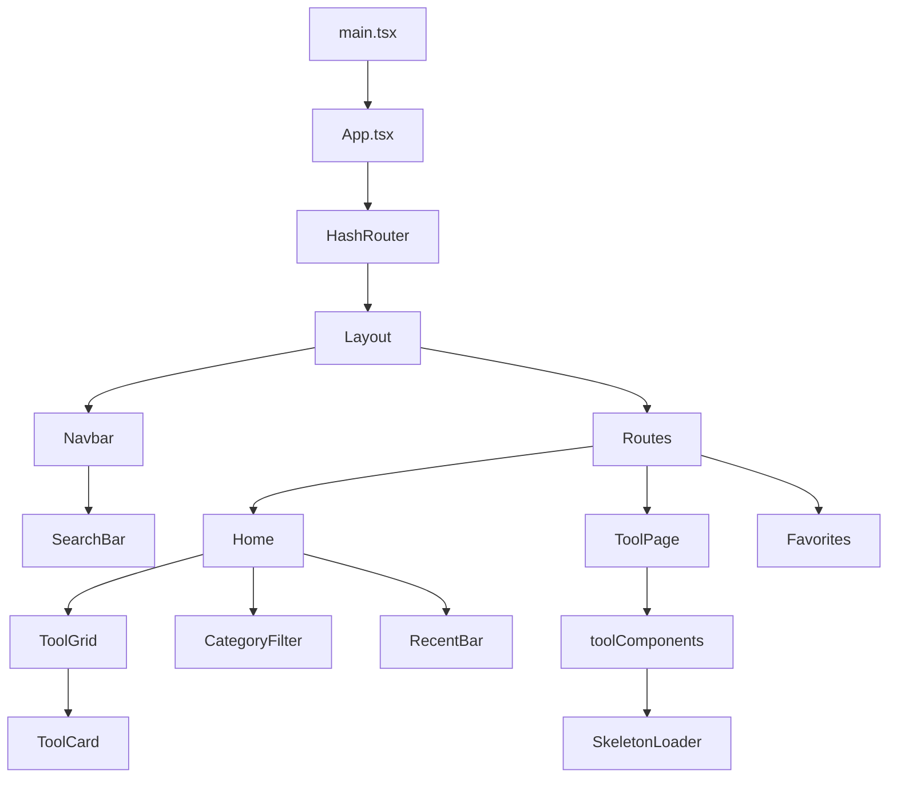

# 项目架构

本文档详细描述 ToolKit 的技术架构、核心设计模式和实现细节。

## 总览

ToolKit 是一个纯前端 SPA 应用，使用 React 19 + TypeScript 构建，基于 HashRouter 实现客户端路由。所有工具以懒加载方式按需引入，通过 Zustand 管理全局状态并持久化到 localStorage。应用作为 PWA 可离线运行，通过 GitHub Actions 自动部署到 GitHub Pages。



---

## 核心类型

所有核心类型定义在 `src/types.ts` 中。

### ToolMeta

每个工具的元信息描述，用于注册、搜索和展示。

```typescript
export type Category =
  | 'unit'
  | 'time'
  | 'text'
  | 'image'
  | 'dev'
  | 'math'
  | 'game';

export interface ToolMeta {
  id: string;            // 唯一标识，如 'unit-length', 'dev-uuid'
  name: string;          // 显示名称，如 '长度换算'
  description: string;   // 简短描述，用于卡片副标题
  category: Category;    // 所属分类
  icon: string;          // emoji 图标
  tags: string[];        // 搜索关键词
  isNew?: boolean;       // 是否标记"新"
  isHot?: boolean;       // 是否标记"热门"
}
```

`Category` 是一个字符串字面量联合类型，保证类型安全。当前实际使用的分类为 `unit`、`time`、`text`、`dev`、`game` 五种，`image` 和 `math` 为预留扩展分类。

---

## 工具注册系统

工具的发现与加载通过 `src/registry.ts` 统一管理，这是项目的核心中枢文件。

### 静态元信息注册

所有 20 个工具的 `ToolMeta` 以数组形式集中声明，无需动态扫描文件系统，在构建时即可完全确定。

```typescript
export const toolMetas: ToolMeta[] = [
  { id: 'unit-length', name: '长度换算', /* ... */, isHot: true },
  { id: 'dev-uuid',    name: 'UUID 生成器', /* ... */ },
  // ... 共 20 个条目
];
```

### 分类定义

分类的排序和展示信息同样集中管理，首页的 CategoryFilter 组件消费此数据。

```typescript
export const categories = [
  { id: 'all',  label: '全部',     icon: '⚡' },
  { id: 'unit', label: '单位换算', icon: '⚖️' },
  { id: 'time', label: '时间日期', icon: '🕐' },
  { id: 'text', label: '文本处理', icon: '📝' },
  { id: 'dev',  label: '开发工具', icon: '💻' },
  { id: 'game', label: '小游戏',   icon: '🎮' },
] as const;
```

`as const` 确保数组类型被收窄为字面量元组，`categories[0].id` 的类型为 `"all"` 而非 `string`。

### 懒加载映射表

每个工具组件通过 `React.lazy()` 包装为可懒加载的模块。这是一个 `Record<string, LazyExoticComponent>`，键为工具 ID，值为懒加载函数。

```typescript
export const toolComponents: Record<string, React.LazyExoticComponent<any>> = {
  'unit-length':       lazy(() => import('./tools/unit-length')),
  'unit-weight':       lazy(() => import('./tools/unit-weight')),
  'unit-temperature':  lazy(() => import('./tools/unit-temperature')),
  'unit-data':         lazy(() => import('./tools/unit-data')),
  'time-timestamp':    lazy(() => import('./tools/time-timestamp')),
  // ... 全部 20 个工具
  'game-sudoku':       lazy(() => import('./tools/game-sudoku')),
};
```

Vite 在构建时根据这些 `import()` 调用自动进行代码分割，每个工具被编译为独立的 chunk。用户打开某个工具时，仅加载该工具对应的 JS bundle，而不会一次性加载全部 20 个工具。

### 添加新工具的完整流程

假设要添加一个"正则表达式测试"工具（`dev-regex`），需要三步：

**步骤 1** — 创建目录和文件：

```
src/tools/dev-regex/
├── index.tsx   # 默认导出 React 组件
└── meta.ts     # 重新导出 toolMetas（工具引用自身 meta 用）
```

**步骤 2** — 在 `src/registry.ts` 中注册：

```typescript
// 在 toolMetas 数组中追加
{ id: 'dev-regex', name: '正则测试', description: '在线正则表达式测试工具',
  category: 'dev', icon: '🔣', tags: ['regex', '正则'], isNew: true },

// 在 toolComponents 对象中追加
'dev-regex': lazy(() => import('./tools/dev-regex')),
```

**步骤 3** — 工具自动出现在首页，支持搜索和分类过滤。

---

## 懒加载与 Suspense

懒加载由两层机制配合实现：

### React.lazy + Suspense

`toolComponents` 中的每个条目都是 `React.lazy()` 包装的组件。在 `ToolPage` 中渲染时包裹在 `<Suspense>` 内，加载期间展示骨架屏。

```tsx
<Suspense fallback={<SkeletonLoader />}>
  <div style={{ padding: 32 }}>
    <Component />
  </div>
</Suspense>
```

### 骨架屏加载态

`SkeletonLoader` 是一个纯内联样式的占位组件，模拟工具内容的视觉结构，使用 CSS `pulse` 动画提供加载反馈，无额外依赖。

```tsx
function SkeletonLoader() {
  const t = useTheme();
  return (
    <div style={{ padding: 32 }}>
      {/* 标题占位 */}
      <div style={{
        width: '40%', height: 20, background: t.hover,
        borderRadius: 6, animation: 'pulse 1.5s ease-in-out infinite'
      }} />
      {/* 内容占位 */}
      <div style={{
        height: 200, background: t.hover,
        borderRadius: 6, animation: 'pulse 1.5s ease-in-out infinite 0.1s'
      }} />
    </div>
  );
}
```

### Vite 代码分割

Vite 打包时，每个 `lazy(() => import('./tools/...'))` 调用生成一个独立的 JS chunk。最终产物结构如下：

```
dist/assets/
├── index-xxxxx.js          # 主 bundle（Layout, Home, 公共组件）
├── unit-length-xxxxx.js    # 长度换算工具
├── dev-uuid-xxxxx.js        # UUID 生成器
├── game-2048-xxxxx.js       # 2048 游戏
└── ...                      # 其余工具各自独立
```

用户访问首页时仅加载主 bundle（约 50KB），点击某个工具后才按需加载其 chunk。

---

## 状态管理

全局状态使用 Zustand + `persist` 中间件实现，定义在 `src/store/useAppStore.ts`。

### Store 结构

```typescript
import { create } from 'zustand';
import { persist } from 'zustand/middleware';

export type ThemeMode = 'dark' | 'light';

interface AppStore {
  favorites: string[];       // 收藏的工具 ID 列表
  recentTools: string[];     // 最近使用的工具 ID 列表（最多 8 个）
  theme: ThemeMode;          // 当前主题
  toggleFavorite: (id: string) => void;
  addRecent: (id: string) => void;
  toggleTheme: () => void;
}

export const useAppStore = create<AppStore>()(
  persist(
    (set, get) => ({
      favorites: [],
      recentTools: [],
      theme: 'dark',

      toggleFavorite: (id) => {
        const favs = get().favorites;
        set({
          favorites: favs.includes(id)
            ? favs.filter(f => f !== id)
            : [id, ...favs]
        });
      },

      addRecent: (id) => {
        const recent = get().recentTools.filter(r => r !== id);
        set({ recentTools: [id, ...recent].slice(0, 8) });
      },

      toggleTheme: () => {
        set({ theme: get().theme === 'dark' ? 'light' : 'dark' });
      },
    }),
    { name: 'toolbox-store' }
  )
);
```

### persist 中间件

Zustand 的 `persist` 中间件自动将 store 状态序列化到 `localStorage`，键名为 `toolbox-store`。页面刷新后状态自动恢复，包括：

- 用户收藏的工具列表
- 最近使用的工具历史
- 主题偏好（深色/浅色）

无需手动序列化/反序列化，Zustand 内部处理 JSON 序列化与订阅同步。

### 访问模式

组件通过选择器函数精确订阅需要的状态片段，避免不必要的重渲染：

```tsx
// 仅订阅 favorites，recentTools 变化不会触发此组件重渲染
const favorites = useAppStore((s) => s.favorites);

// 仅订阅 action，store 任何变化都不会触发重渲染（函数引用稳定）
const toggleTheme = useAppStore((s) => s.toggleTheme);
```

---

## 主题系统

主题系统由三个层次协同工作，定义在 `src/theme.ts` 和 `src/index.css`。

### 色板定义

深色和浅色各有一套 15 色的完整色板，通过 `ThemeColors` 接口约束结构：

```typescript
export interface ThemeColors {
  bg: string;            // 页面背景
  card: string;          // 卡片背景
  hover: string;         // 悬停态背景
  primary: string;       // 主色调（品牌蓝）
  primaryHover: string;  // 主色调悬停
  green: string;         // 成功/数据色
  purple: string;        // 时间分类色
  yellow: string;        // 开发/收藏色
  pink: string;          // 游戏分类色
  text: string;          // 主文本
  textSecondary: string; // 次要文本
  textHint: string;      // 提示文本
  border: string;        // 边框
  borderHover: string;   // 边框悬停
  inputBg: string;       // 输入框背景
}

const dark: ThemeColors = {
  bg: '#0F0F11',
  card: '#141418',
  // 共 15 个色值 ...
};

const light: ThemeColors = {
  bg: '#F5F5F8',
  card: '#FFFFFF',
  // 共 15 个色值 ...
};
```

### useTheme Hook

提供 React 组件访问当前主题色的统一入口。内部从 Zustand store 读取当前主题模式并返回对应的色板对象。

```typescript
export function useTheme(): ThemeColors {
  const theme = useAppStore((s) => s.theme);
  return themeMap[theme];
}
```

用法极其简洁：

```tsx
function MyComponent() {
  const t = useTheme();
  return <div style={{ background: t.card, color: t.text }}>...</div>;
}
```

### CSS 变量系统

除 JS 侧色板外，CSS 变量为全局样式（body、input、textarea、select、滚动条等）提供主题切换能力。`applyThemeToDocument` 函数在主题切换时将模式写入 `data-theme` 属性：

```typescript
export function applyThemeToDocument(mode: ThemeMode) {
  document.documentElement.setAttribute('data-theme', mode);
}
```

```css
:root {
  --bg: #0F0F11;
  --card: #141418;
  --primary: #4F8EF7;
  --text: #E0E0E8;
  --text-secondary: #888890;
  --border: #2a2a30;
  /* ... */
}

[data-theme="light"] {
  --bg: #F5F5F8;
  --card: #FFFFFF;
  --primary: #3B7DE6;
  --text: #1A1A24;
  --text-secondary: #6B6B76;
  --border: #E0E0E4;
  /* ... */
}
```

### 主题切换流程

1. 用户点击 Navbar 中的主题切换按钮
2. 调用 `useAppStore.getState().toggleTheme()`
3. Zustand 更新 `theme` 状态，persist 中间件自动同步到 localStorage
4. `Layout` 组件的 `useEffect` 检测到 `theme` 变化，调用 `applyThemeToDocument`
5. `data-theme` 属性切换，CSS 变量全部换色，所有组件通过 `useTheme()` 获取新色板

---

## 组件树

### 入口与路由

```
main.tsx
└── App.tsx
    └── HashRouter
        └── Layout
            ├── Navbar
            │   └── SearchBar
            └── <Routes>
                ├── "/"          → Home
                │   ├── SearchBar
                │   ├── CategoryFilter
                │   ├── RecentBar
                │   └── ToolGrid
                │       └── ToolCard (× N)
                ├── "/tool/:id"  → ToolPage
                │   └── Suspense → 工具组件
                └── "/favorites" → Favorites
                    └── ToolGrid
```

### Layout

`Layout` 是全局容器，负责：

1. 渲染固定定位的 `Navbar`（高 56px，`z-index: 100`）
2. 通过 `SearchContext` 向下传递搜索状态，使 `Navbar` 和 `Home` 共享同一个搜索输入
3. 监听 `theme` 状态变化，自动调用 `applyThemeToDocument` 同步 CSS 变量

```tsx
export const SearchContext = createContext<SearchContextType>({
  searchQuery: '',
  setSearchQuery: () => {},
});
```

### Navbar

固定顶部导航栏，包含四个元素：

- **Logo**：`⚡ ToolKit`，等宽字体，链接到首页
- **SearchBar**：居中，宽 300px，带搜索图标
- **主题切换按钮**：圆形药丸样式，显示太阳/月亮 emoji
- **文档链接**：指向 `/toolbox/docs/`
- **收藏入口**：显示爱心图标 + 收藏计数 badge

### Home 页面

首页的核心逻辑是**搜索与分类过滤**：

```typescript
const filtered = useMemo(() => {
  return toolMetas.filter((tool) => {
    // 分类过滤
    if (activeCategory !== 'all' && tool.category !== activeCategory) return false;
    // 搜索过滤（匹配名称、描述、标签）
    if (searchQuery) {
      const q = searchQuery.toLowerCase();
      return (
        tool.name.toLowerCase().includes(q) ||
        tool.description.toLowerCase().includes(q) ||
        tool.tags.some((tag) => tag.toLowerCase().includes(q))
      );
    }
    return true;
  });
}, [activeCategory, searchQuery]);
```

搜索结果或分类筛选时以平铺网格展示；默认状态下按分类分组展示，每个分组带颜色指示点和工具计数。

### ToolPage

工具详情页的核心流程：

1. 从 URL 参数 `:id` 获取工具 ID
2. 在 `toolMetas` 中查找对应元信息
3. 在 `toolComponents` 中查找对应懒加载组件
4. 渲染面包屑导航（返回按钮 + 图标 + 名称 + 分类标签 + 收藏按钮）
5. 在 `<Suspense>` 中渲染工具组件
6. `useEffect` 中调用 `addRecent(id)` 记录使用历史

如果 `:id` 无效（404），展示友好提示页面和返回首页链接。

---

## 路由设计

使用 React Router v7 的 `HashRouter`，所有路由以 `#` 分隔，兼容 GitHub Pages 静态托管（无服务端路由支持）。

| 路径 | 页面 | 说明 |
|------|------|------|
| `/#/` | Home | 首页，工具网格、搜索、分类过滤 |
| `/#/tool/:id` | ToolPage | 单个工具详情页，懒加载工具组件 |
| `/#/favorites` | Favorites | 收藏的工具列表 |

选择 HashRouter 而非 BrowserRouter 的原因：GitHub Pages 作为静态文件服务器，只响应 `index.html`，对 `/tool/xxx` 这样的路径会返回 404。HashRouter 的路由信息存储在 URL hash 中（`#/tool/xxx`），服务端始终返回 `index.html`，由客户端解析 hash 完成路由匹配。

---

## PWA 配置

PWA 功能通过 `vite-plugin-pwa` 实现，配置集中在 `vite.config.ts`。

```typescript
import { VitePWA } from 'vite-plugin-pwa';

VitePWA({
  registerType: 'autoUpdate',
  includeAssets: ['favicon.ico'],
  manifest: {
    name: '在线工具箱',
    short_name: 'ToolKit',
    description: '无需安装，离线可用的在线工具集合',
    theme_color: '#0F0F11',
    background_color: '#0F0F11',
    display: 'standalone',
    start_url: '/toolbox/',
    icons: [
      { src: 'icons/icon-192.png', sizes: '192x192', type: 'image/png' },
      { src: 'icons/icon-512.png', sizes: '512x512', type: 'image/png' }
    ]
  },
  workbox: {
    globPatterns: ['**/*.{js,css,html,ico,png,svg,woff2}'],
  }
})
```

### 关键配置项说明

| 配置 | 说明 |
|------|------|
| `registerType: 'autoUpdate'` | Service Worker 检测到新版本后自动更新，无需用户手动刷新 |
| `display: 'standalone'` | 以独立应用窗口打开，隐藏浏览器地址栏和工具栏 |
| `theme_color` / `background_color` | 启动闪屏颜色，与深色主题背景一致 |
| `start_url` | PWA 启动时加载的路径，设为 `/toolbox/` 匹配 GitHub Pages 部署路径 |
| `workbox.globPatterns` | 预缓存的静态资源类型，确保核心文件离线可用 |

### 离线工作原理

1. 用户首次访问 → Service Worker 注册并安装
2. Workbox 预缓存 `globPatterns` 匹配的所有静态资源
3. 后续请求优先从缓存响应（Cache First 策略）
4. 新版本发布 → `autoUpdate` 机制自动下载新 SW 并激活
5. 所有工具逻辑为纯前端计算（无 API 调用），离线后功能完全可用

---

## 部署流程

CI/CD 通过 GitHub Actions 自动执行，定义在 `.github/workflows/deploy.yml`。

### 触发条件

```yaml
on:
  push:
    branches: [main]
```

每次向 `main` 分支推送代码时自动触发部署流水线。

### 构建步骤

```yaml
jobs:
  deploy:
    runs-on: ubuntu-latest
    steps:
      - uses: actions/checkout@v4
      - uses: actions/setup-node@v4
        with:
          node-version: 20
          cache: 'npm'
      - run: npm ci
      - run: npm run build              # 构建主应用 (Vite)
      - run: npm run docs:build         # 构建文档 (VitePress)
      - run: mkdir -p dist/docs && cp -r docs/.vitepress/dist/* dist/docs/
      - uses: peaceiris/actions-gh-pages@v4
        with:
          github_token: ${{ secrets.GITHUB_TOKEN }}
          publish_dir: ./dist
          force_orphan: true
```

### 步骤详解

1. **checkout** — 拉取最新代码
2. **setup-node** — 安装 Node.js 20，启用 npm 缓存加速
3. **npm ci** — 严格根据 `package-lock.json` 安装依赖
4. **npm run build** — `tsc -b && vite build`，类型检查通过后 Vite 构建主应用到 `dist/`
5. **npm run docs:build** — `vitepress build docs`，构建文档到 `docs/.vitepress/dist/`
6. **合并产物** — 将文档构建产物复制到 `dist/docs/`，使文档可通过 `/toolbox/docs/` 访问
7. **gh-pages 部署** — `peaceiris/actions-gh-pages@v4` 将 `dist/` 推送到 `gh-pages` 分支，`force_orphan: true` 确保每次部署为单次提交（不保留历史，减小仓库体积）

### 访问路径映射

| 路径 | 内容 |
|------|------|
| `https://zyssnh.github.io/toolbox/` | 主应用（Vite 构建） |
| `https://zyssnh.github.io/toolbox/docs/` | 文档站点（VitePress 构建） |

应用和文档共享同一域名，通过 `base` 配置区分路径前缀。Vite 配置 `base: '/toolbox/'`，VitePress 配置 `base: '/toolbox/docs/'`。
